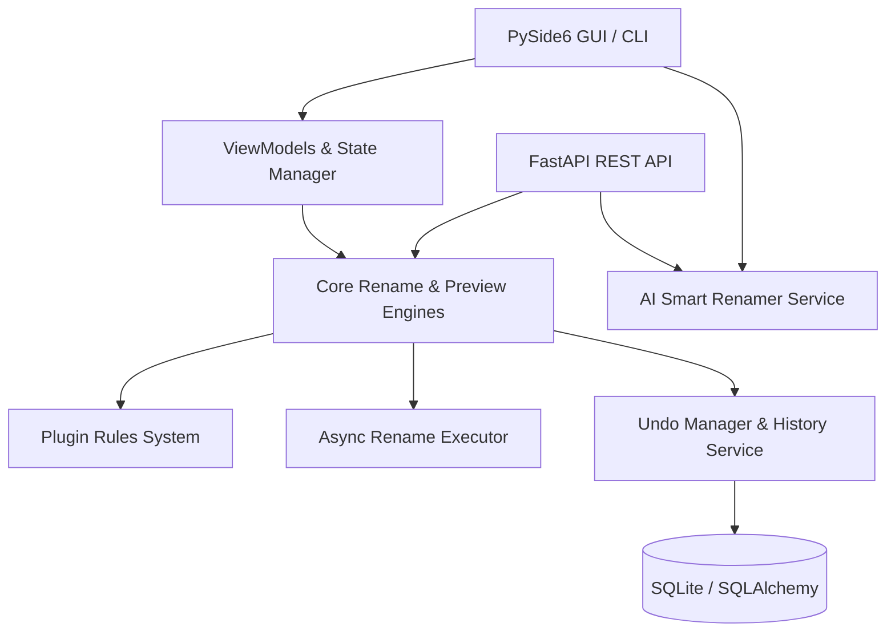

# Bulk File Renamer Platform Architecture Overview

## 1. System Architecture

The Bulk File Renamer platform is designed with a layered, decoupled architecture separating UI presentations, reactive view models, business core engines, and backend services.

## 2. Core Layers

### Presentation Layer (`ui/`)
- **Main Window (`ui/main_window.py`)**: Central desktop GUI built on PySide6. Provides drag-and-drop file ingestion, rule pipeline composition, real-time collision preview, and action execution.
- **Dialogs (`ui/dialogs/`)**:
  - `rule_dialogs.py`: Interactive configuration modals for each rule type (Prefix, Suffix, Replace, Regex, Sequential, Extension).
  - `history_dialog.py`: Interactive inspection of historical batch operations with one-click rollback.
  - `ai_dialog.py`: Natural language prompt interface for smart naming suggestions.
- **Components (`ui/components/`)**:
  - `preview_table.py`: Real-time color-coded preview grid highlighting valid paths, collisions, and filesystem errors.
  - `rule_list.py`: Reorderable list supporting internal drag-and-drop, keyboard removal, and double-click editing.
- **ViewModels (`ui/viewmodels/`)**:
  - `rename_viewmodel.py`: MVVM pattern coordinator exposing Qt signals for reactive UI updates and testability.

### Core Engine Layer (`core/`)
- **`rename_engine/pipeline.py`**: Ordered sequence of rename rules. Applies transformations sequentially to file names.
- **`preview_engine/preview.py`**: Collision detection, character validation, and dry-run preview item generation.
- **`rename_engine/executor.py`**: Thread-pooled asynchronous batch execution with per-item status tracking.
- **`undo_engine/manager.py`**: Rollback manager capable of reverting entire transactions atomically.
- **`state_manager/`**: Coordinates session state, observer callbacks, and JSON preset persistence.

### Services Layer (`services/`)
- **History Service (`services/history_service/`)**: Audit and transaction history management.
- **AI Service (`services/ai_service/`)**: Heuristic natural language parser and LLM connector.
- **REST API (`services/api/`)**: High-performance FastAPI backend exposing all core operations over HTTP.
- **File Management (`services/file_management/`)**: Recursive directory scanning and regex-based filtering.

### Database Layer (`db/`)
- SQLite database (`history.db`) managed via SQLAlchemy ORM models (`Transaction`, `RenameOperation`).
