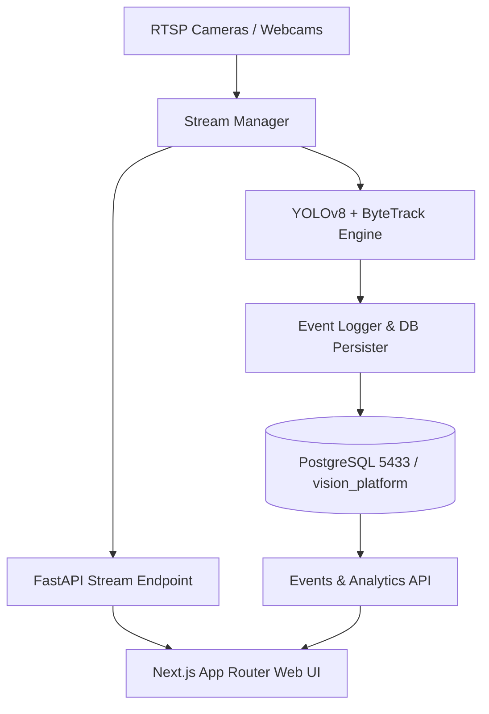

# Enterprise AI Vision Platform - Architecture Guide

## System Overview
The Enterprise AI Vision Platform is a high-throughput, real-time computer vision and object intelligence system designed for surveillance, threat detection, perimeter monitoring, and multi-camera stream processing.

## Core Components
1. **FastAPI Backend (`/backend`)**:
   - High-performance asynchronous REST API running on port 8000.
   - JWT OAuth2 authentication with role-based access control (Admin, Operator, Viewer).
   - MJPEG multipart video streaming with query parameter token authentication.
   - Database operations managed via SQLAlchemy 2.0 with connection pooling.

2. **Computer Vision & Tracking Engine (`/backend/app/engine`)**:
   - Ultralytics YOLOv8n object detection model.
   - ByteTrack multi-object tracking algorithm (`persist=True`).
   - Resilient simulated HUD frame generation fallback for local testing without physical RTSP hardware.

3. **Database Layer (PostgreSQL on Port 5433)**:
   - Database: `vision_platform`
   - User: `postgres` / `root`
   - Managed through version-controlled Alembic migrations (`alembic/versions/`).
   - Tables: `users`, `cameras`, `events`.

4. **Next.js Frontend (`/frontend`)**:
   - Built on Next.js 16 (App Router) + React 19 + Tailwind CSS + Recharts.
   - Client AppShell architecture resolving React Server/Client boundaries.
   - Live camera stream player, interactive 24-hour detection velocity chart, events audit table with CSV/JSON export, and system telemetry monitor.
