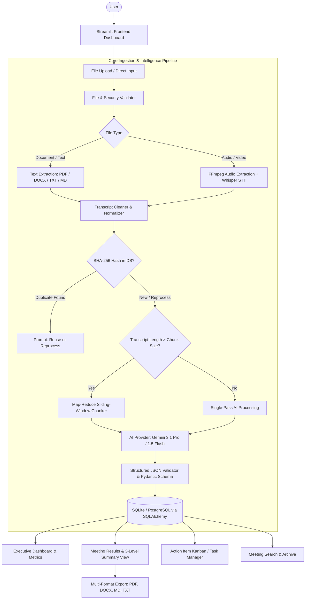

# 🎙️ NotePulse AI — AI Meeting Notes Summarizer

> **Enterprise-Grade AI Meeting Intelligence Platform**
> Turn raw meeting audio, video recordings, and long transcripts into executive summaries, confirmed decisions, and assigned action items with zero hallucinations.

---

## 🌟 Executive Overview

**NotePulse AI** is a production-grade, portfolio-quality AI meeting notes summarizer built with **Python**, **Streamlit**, **SQLAlchemy**, **Google Gemini AI (3.1 Pro / 1.5 Flash)**, and **OpenAI Whisper STT**.

It handles both text transcripts (`.pdf`, `.docx`, `.txt`, `.md`) and multimedia recordings (`.mp3`, `.wav`, `.m4a`, `.webm`, `.mp4`, `.mov`). For large meeting transcripts exceeding model single-pass limits, it employs a **hierarchical Map-Reduce sliding-window chunking engine** with semantic overlap.

---

## 🏛️ System Architecture & Workflow



---

## ✨ Key Features

- **Multi-Format Ingestion:**
  - **Documents:** `.txt`, `.md`, `.docx`, `.pdf`
  - **Audio:** `.mp3`, `.wav`, `.m4a`, `.webm`
  - **Video:** `.mp4`, `.webm`, `.mov` (extracts audio stream automatically)
- **Decoupled Architecture:** Speech-to-Text transcription is completely isolated from AI summarization.
- **Strict Anti-Hallucination Guardrails:** AI prompts enforce strict grounding. If assignees, deadlines, or roles are not stated, they are explicitly marked as `"Not specified"`.
- **3-Level Summary Switcher:**
  - **Quick Summary:** 2–3 sentence executive brief.
  - **Standard Summary:** 2–3 structured paragraphs with key highlights.
  - **Detailed Summary:** Deep-dive breakdown of discussions, debates, and outcomes.
- **Action Item Extraction & Task Board:** Detects tasks, assignees, deadlines, and priorities (`LOW`, `MEDIUM`, `HIGH`, `CRITICAL`) with status tracking (`PENDING`, `IN_PROGRESS`, `COMPLETED`).
- **Decisions & Open Questions:** Distinguishes confirmed decisions from tentative discussions.
- **Hierarchical Map-Reduce Chunking:** Automatically splits large transcripts with line-aware overlap and synthesizes chunk summaries into a cohesive master report.
- **Duplicate Detection & Caching:** Uses SHA-256 content hashing to avoid reprocessing identical files and save API costs.
- **Multi-Format Export Engine:** Professional PDF (via ReportLab with tables and badges), Microsoft Word (`.docx`), GitHub-flavored Markdown (`.md`), and plain text (`.txt`).
- **Full Mock Mode:** Complete out-of-the-box development and testing capability without consuming live API credits.
- **Secret Redacting Logger:** Custom logging formatter automatically redacts Google/OpenAI API keys and tokens.

---

## 🗂️ Project Structure

```
ai-meeting-notes/
├── app/
│   ├── main.py                     # Streamlit application entrypoint
│   ├── config/
│   │   ├── __init__.py
│   │   └── settings.py             # Pydantic Settings & environment variables
│   ├── database/
│   │   ├── __init__.py
│   │   ├── connection.py           # SQLAlchemy engine & session management
│   │   └── models.py               # Meeting, Transcript, Summary, ActionItem, etc.
│   ├── providers/
│   │   ├── __init__.py
│   │   ├── ai_provider.py          # Abstract AIProvider & Pydantic schemas
│   │   ├── gemini_provider.py      # Google Gemini 3.1 Pro / 1.5 Flash provider
│   │   ├── transcription_provider.py # Abstract TranscriptionProvider
│   │   ├── whisper_provider.py     # OpenAI Whisper STT integration
│   │   └── mock_provider.py        # High-fidelity Mock AI & STT providers
│   ├── services/
│   │   ├── __init__.py
│   │   ├── file_service.py         # Multi-format document text extraction
│   │   ├── chunking_service.py     # Sliding window map-reduce chunker
│   │   ├── transcription_service.py# STT coordinator & video audio extraction
│   │   ├── summarization_service.py# AI analysis & schema validation
│   │   ├── meeting_service.py      # CRUD, deduplication, search, and metrics
│   │   └── export_service.py       # PDF, DOCX, Markdown, and TXT exporters
│   ├── utils/
│   │   ├── __init__.py
│   │   ├── logger.py               # Sanitized logger with secret redaction
│   │   ├── security.py             # SHA-256 hashing and filename sanitizer
│   │   ├── validators.py           # File and transcript validators
│   │   └── text_cleaner.py         # Transcript normalization & word counter
│   ├── demo_data/
│   │   ├── __init__.py
│   │   └── seed.py                 # Realistic sample meetings generator
│   └── ui/
│       ├── __init__.py
│       ├── styles.py               # Custom CSS & glassmorphic badges
│       ├── dashboard.py            # Executive KPI dashboard
│       ├── upload.py               # Multi-stage upload & live progress UI
│       ├── meeting.py              # 3-level summary & action items editor
│       ├── action_items.py         # Cross-meeting task tracker
│       ├── history.py              # Full-text search & archive
│       └── settings.py             # System configuration viewer
├── tests/
│   ├── conftest.py                 # In-memory SQLite & mock fixtures
│   ├── test_validators.py          # Validation unit tests
│   ├── test_file_service.py        # Document text extraction tests
│   ├── test_cleaner_chunker.py     # Cleaning & chunking tests
│   ├── test_ai_provider.py         # Schema & AI provider tests
│   ├── test_database.py            # Database model & cascade tests
│   ├── test_meeting_service.py     # Business logic & deduplication tests
│   ├── test_export.py              # PDF, DOCX, MD, TXT export tests
│   └── test_pipeline.py            # End-to-end integration tests
├── .env.example
├── .gitignore
├── requirements.txt
├── run.py                          # Convenience launcher
└── README.md
```

---

## 🚀 Quick Start Guide

### 1. Prerequisites
- Python 3.10+ (tested on Python 3.11)
- Optional: `ffmpeg` for video-to-audio extraction

### 2. Clone & Install Dependencies
```bash
cd "d:\python projects\ai-meeting-notes"
pip install -r requirements.txt
```

### 3. Configure Environment Variables
Copy `.env.example` to `.env`:
```bash
cp .env.example .env
```

Edit `.env` to configure your keys (or leave empty to run in **Mock Mode**):
```ini
# App Environment
APP_ENV=development
DEBUG=true

# Database (SQLite by default, PostgreSQL supported)
DATABASE_URL=sqlite:///./meeting_notes.db

# AI Provider Configuration (gemini or mock)
AI_PROVIDER=gemini
GEMINI_API_KEY=your_google_gemini_api_key_here
GEMINI_MODEL=gemini-1.5-flash

# Transcription Provider Configuration (whisper or mock)
TRANSCRIPTION_PROVIDER=mock
WHISPER_API_KEY=your_openai_whisper_api_key_here

# File Limits & Chunking
MAX_FILE_SIZE_MB=100
CHUNK_SIZE=4000
CHUNK_OVERLAP=400
MAX_TRANSCRIPT_LENGTH=50000

# Logging
LOG_LEVEL=INFO
```

### 4. Run the Application
Launch via Streamlit or the convenience runner:
```bash
python run.py
```
Or directly:
```bash
streamlit run app/main.py
```

The application will open in your browser at `http://localhost:8501`.

---

## 🧪 Testing & Quality Assurance

Run the complete automated test suite (18 unit and integration tests):
```bash
pytest tests/ -v
```

All tests run against an isolated **in-memory SQLite database** using mock providers, ensuring zero external API requests or billable token consumption during automated tests.

---

## 🛡️ Security & Privacy Guardrails

1. **Secret Redaction:** `app/utils/logger.py` actively strips API keys (`AIza...`, `sk-...`, Bearer tokens) before writing to console or disk.
2. **Safe Filenames:** `app/utils/security.py` removes path traversal characters (`../`, `\`, null bytes) and limits filename lengths.
3. **No File Execution:** Uploaded files are strictly parsed as data; never executed.
4. **Environment Isolation:** Secrets are loaded strictly via `.env` and never hardcoded in source files.

---

## 📦 Database Schema

The database uses **SQLAlchemy ORM** supporting SQLite and PostgreSQL:

| Table | Description |
| :--- | :--- |
| `meetings` | Master meeting records, file metadata, status, duration, processing duration, and SHA-256 hash |
| `transcripts` | Raw & cleaned transcripts, word count, diarization flag, and language |
| `summaries` | Quick, standard, and detailed summaries, topics, key points, decisions, and questions (JSON) |
| `action_items` | Tasks, assignees, deadlines, priority (`LOW`/`MEDIUM`/`HIGH`/`CRITICAL`), and status (`PENDING`/`IN_PROGRESS`/`COMPLETED`) |
| `participants` | Participant names and detected organizational roles |
| `processing_logs`| Audit log of pipeline execution steps and timing |
| `application_settings` | Dynamic key-value configuration overrides |

---

## 🔮 Roadmap & Future Enhancements

- [ ] Live audio streaming microphone capture directly in browser.
- [ ] Speaker diarization using PyAnnote.audio.
- [ ] Direct export integrations (Slack Webhook, Notion API, Google Docs, Jira / Asana tasks).
- [ ] Multi-lingual automatic translation and cross-language summarization.

